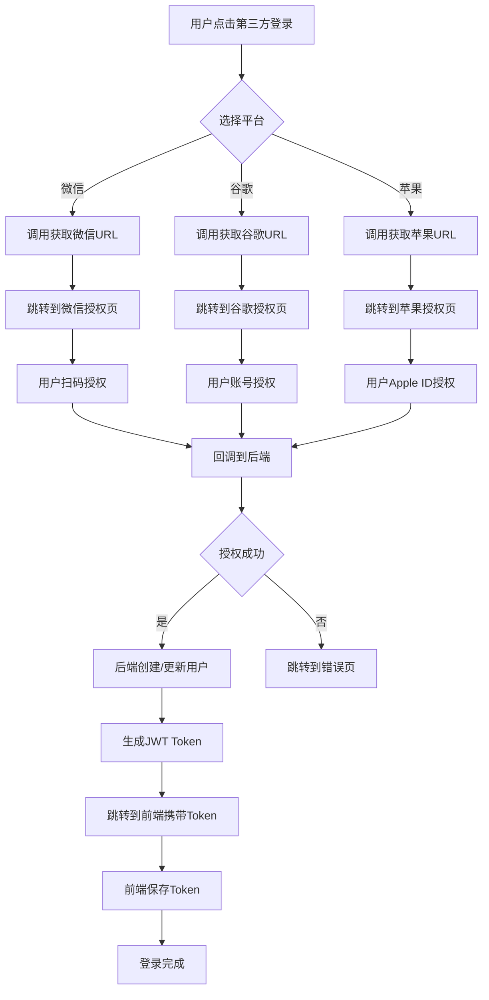
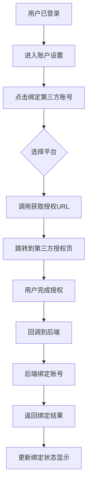

# 第三方认证对接指导手册

## 概述

本文档为前端开发人员提供第三方登录功能的完整对接指导，包括微信扫码登录、谷歌账号授权、苹果账号授权三种方式的详细API说明和集成流程。

## 基础信息

- **后端API前缀**：`/api/web/auth`
- **支持的第三方平台**：
  - `wechatOpen`：微信开放平台扫码登录
  - `google`：google OAuth2登录
  - `apple`：Apple Sign In登录

## API接口详情

### 1. 获取第三方授权URL

**接口地址**：`GET /api/web/auth/redirect/{source}`

**功能说明**：获取指定第三方平台的授权URL，前端跳转到该URL进行授权

**请求参数**：

| 参数名 | 类型 | 必填 | 说明 |
|--------|------|------|------|
| source | String | 是 | 第三方平台来源：wechatOpen、google、APPLE |
| state | String | 否 | 状态参数，用于防止CSRF攻击，建议使用UUID |

**请求示例**：
```javascript
// 获取微信扫码登录URL
const response = await fetch('/api/web/auth/redirect/wechatOpen?state=abc123');
const data = await response.json();
window.location.href = data.data;
```

**响应示例**：
```json
{
  "code": 200,
  "msg": "success",
  "data": "https://open.weixin.qq.com/connect/oauth2/authorize?appid=xxx&redirect_uri=xxx&response_type=code&scope=snsapi_login&state=abc123#wechat_redirect"
}
```

### 2. 处理授权回调（自动跳转）

**接口地址**：`GET /api/web/auth/callback/{source}`

**功能说明**：第三方平台授权完成后的回调后端服务，后端服务处理完毕以后跳转到前端页面

**请求参数**：

| 参数名 | 类型 | 必填 | 说明 |
|--------|------|------|------|
| source | String | 是 | 第三方平台来源 |
| code | String | 是 | 授权码 |
| state | String | 否 | 状态参数 |
| error | String | 否 | 错误信息 |
| error_description | String | 否 | 错误描述 |

**跳转规则**：
- **后端代码逻辑处理用户登录成功**：跳转到前端 `http://localhost:3000/auth/callback?token=xxx&expire=43200`
- **后端代码逻辑处理用户登录失败**：跳转到前端 `http://localhost:3000/auth/error?message=xxx`
 

## 前端集成流程

### 1. 基本登录流程



### 2. 账号绑定流程


     
## 错误处理

### 常见错误码

| 错误信息 | 说明 | 解决方案 |
|----------|------|----------|
| 不支持的第三方平台 | source参数错误 | 检查source参数是否正确 |
| 验证码不正确 | Captcha验证失败 | 重新获取验证码 |
| 账号或密码不正确 | 用户认证失败 | 检查用户名密码 |
| 账号已被锁定 | 用户状态异常 | 联系管理员 |
| 您已经绑定了该平台 | 重复绑定 | 检查已绑定状态 |
| 该第三方账号已经被其他用户绑定 | 重复绑定 | 联系客服处理 |
| 请先登录 | Token缺失或无效 | 重新登录 |

### 前端错误处理建议

```javascript
// 统一错误处理
const handleApiError = (error) => {
  if (error.response) {
    const { status, data } = error.response;
    switch (status) {
      case 401:
        message.error('登录已过期，请重新登录');
        // 跳转到登录页
        break;
      case 400:
        message.error(data.msg || '请求参数错误');
        break;
      case 500:
        message.error('服务器内部错误');
        break;
      default:
        message.error('网络错误，请稍后重试');
    }
  } else {
    message.error('网络连接失败');
  }
};
```
